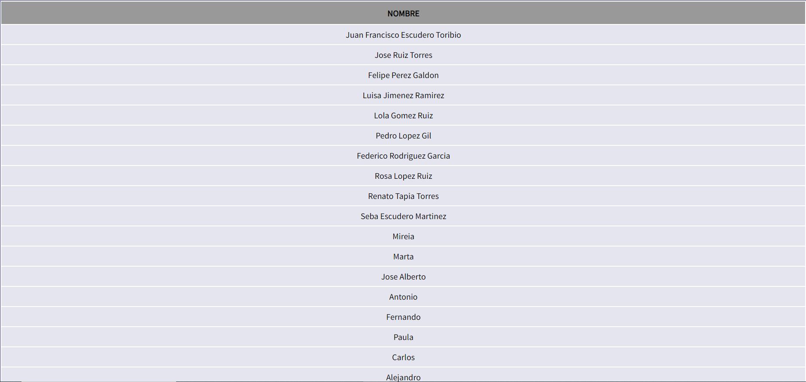

# Práctica 4

## Datos personales integrantes del grupo
* **Nombres:**
    * Lorena Moreno Vilches
    * Elena Alonso Tejederas
    * Modesto Monzón Vázquez
    * Juan Francisco Escudero Toribio
    * José Ballester Marín

* **Correo electrónico:** 
    * lmv00019@red.ujaen.es
    * eat00004@red.ujaen.es
    * mmv00057@red.ujaen.es
    * jfet0001@red.ujaen.es
    * jbm00030@red.ujaen.es

## Enlace tablero Trello
* https://trello.com/b/c08kND2J/pr%C3%A1ctica-4

-------

## Descripción *Sprint Retrospective*
### Que hemos hecho bien
    * Hemos implementado las historias de usuario correctamente
    * La comunicación entre todos los miembros ha sido correcta
    * Se ha respetado el orden a la hora de realizar cambios en el repositorio
    * Hemos decidido entre todos que historias de usuario implementar
    * Hemos logrado cumplir con los objetivos establecidos para el Sprint

### Que hay que mejorar 
    * Hay que realizar un trabajo más progresivo
    * Realizar las HU necesarias para alcanzar el mínimo de nota y no para tener mas de lo posible y ahorrar trabajo. (Simplicidad es esencial)
    * Hay que prestar más atención a los movimientos del Trello
    * Podemos mejorar nuestro código para hacerlo más eficiente
    * Mejoraremos el aspecto visual de la interfaz con bootstrap
    * Añadir validación de datos a los formularios con Alpine js
    * Documentaremos adecuadamente el código en el momento en que se realicen las funciones

### Compromisos
    * Trabajar diariamente en el proyecto
    * Hacer HU necesarias para la nota
    * Prestar más atención a los movimientos que hay que realizar en Trello
    * Mejoraremos nuestro código para hacerlo que sea más eficiente
    * Introducir estilo a los botones y las tablas con bootstrap
    * Los formularios serán seguros para añadir deportistas a la BBDD
    * Realizaremos reuniones de seguimiento periódicas para evaluar el progreso del proyecto

-------

## Descripción *Sprint Review*
## Capturas de pantalla Trello
### Incremento 1 inicio
> En este segundo incremento realizaremos las historias de usuario 1,2 y 3

#### H.U 01
> En esta Historia de Usuario se pretende mostrar toda la funcionaliad de la práctica individual de **Lorena Moreno Vilches**

#### H.U 02
> En esta Historia de Usuario se pretende mostrar toda la funcionaliad de la práctica individual de **Jose Ballester Marín**

#### H.U 03
> En esta Historia de Usuario se pretende mostrar toda la funcionaliad de la práctica individual de **Elena Alonso Tejederas**

### Incremento 1 final

-------

### Incremento 2 inicio
> En este segundo incremento realizaremos las historias de usuario 4,5,6 y 10

#### H.U 04
> En esta Historia de Usuario se pretende mostrar toda la funcionaliad de la práctica individual de **Modesto Monzón Vázquez**

#### H.U 05
> En esta Historia de Usuario se pretende mostrar toda la funcionaliad de la práctica individual de **Juan Francisco Escudero Toribio**

#### H.U 06
> En esta Historia de Usuario se pretende mostrar la información de los desarrolladores de la aplicación al hacer clic en el botón *"Acerca de"*

#### H.U 10
> En esta Historia de Usuario se pretende modificar la visualización de la aplicación al hacer clic en el botón *"Cambiar Contraste"*

### Incremento 2 final

### Incremento 3 inicial
> En este último incremento realizaremos las historias de usuario 7,8 y 9

### H.U 7
> En esta Historia de Usuario se pretende ver un listado de todos los nombres de los jugadores de todos los deportes

### H.U 8
> En esta Historia de Usuario se pretende ver un listado con todos los nombres de los jugadores de todos los deportes ordenados alfabéticamente 

### H.U 9
> En esta Historia de Usuario se pretende mostrar un listado de todos los nombres de los jugadores y su deporte que contengan la cadena introducida 

### Incremento 3 Final

-------

